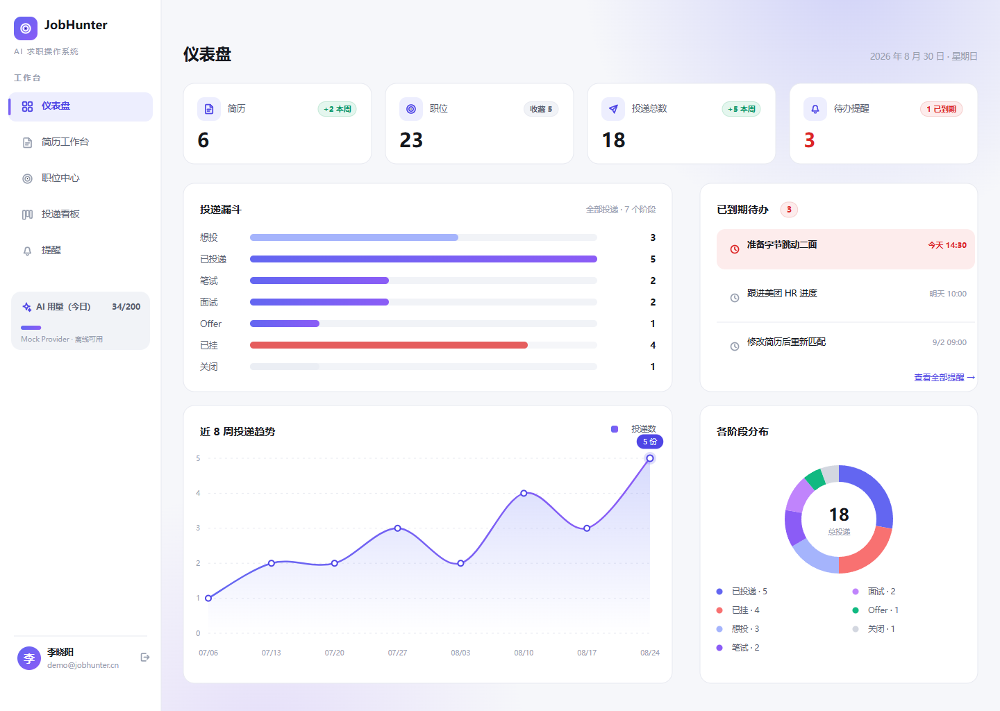
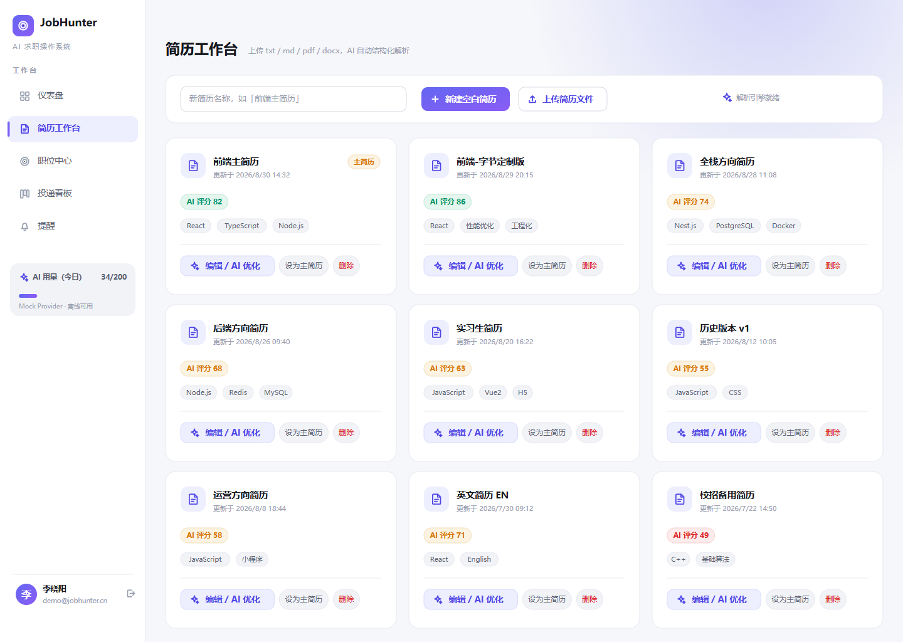
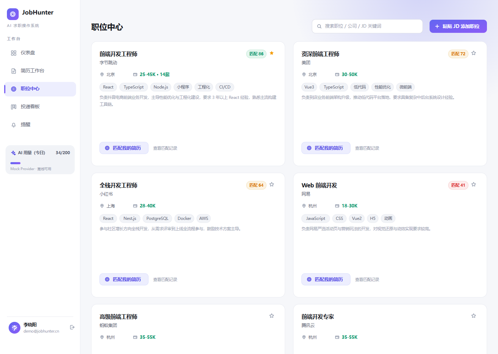
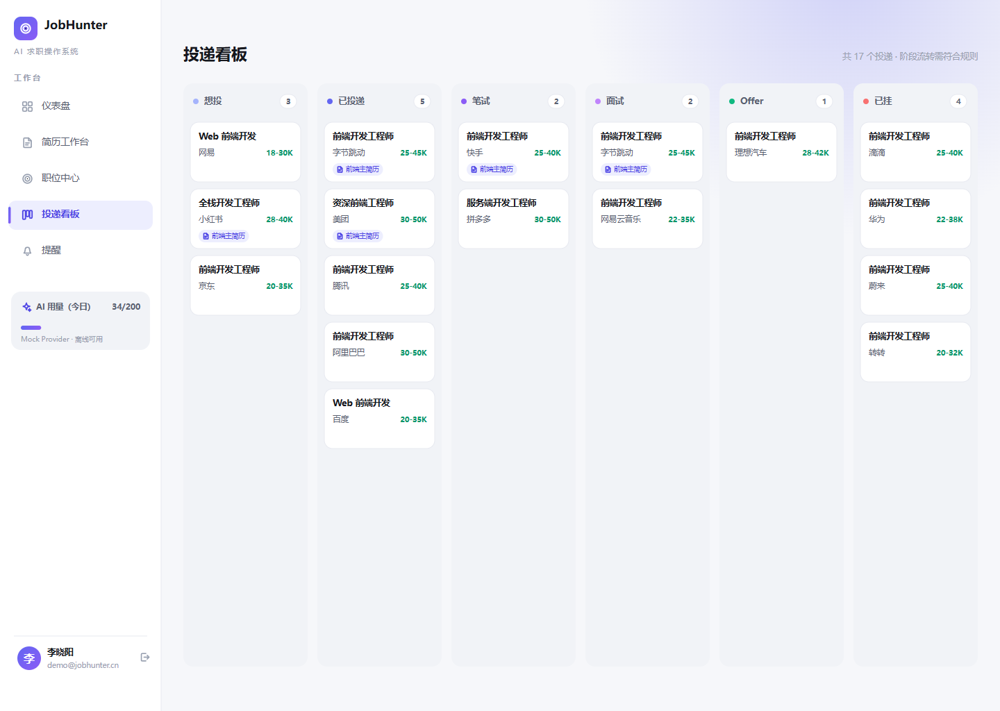
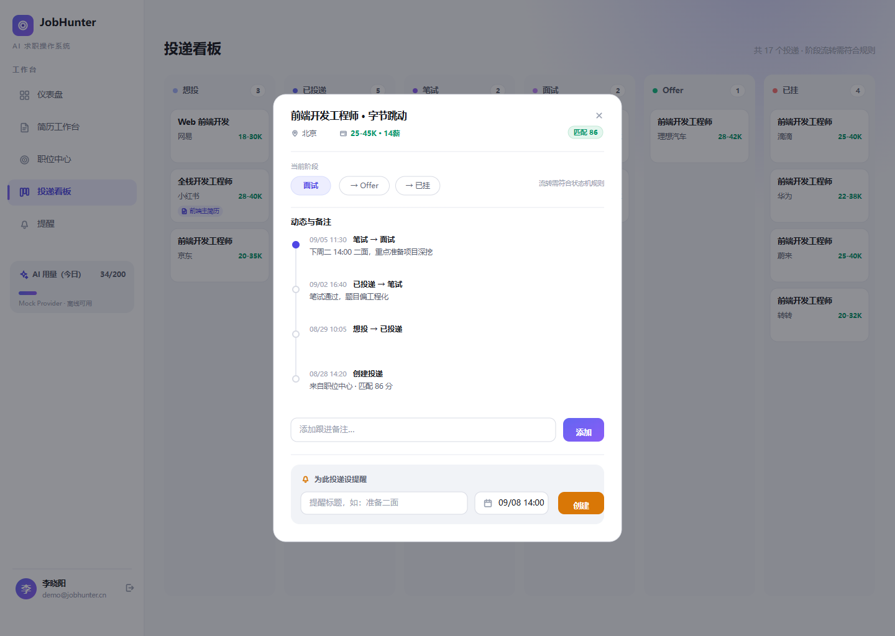
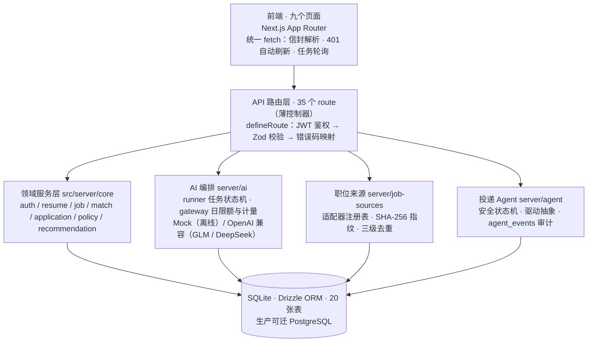

# JobHunter — AI 求职操作系统

<p align="center">
  <picture>
    <source media="(prefers-color-scheme: dark)" srcset="design/preview/dashboard.dark.png">
    
  </picture>
</p>

<p align="center">
  <strong>面向国内求职者的 AI 工作台：简历工作台 × 职位智能匹配 × Agent 半自动投递</strong>
</p>

<p align="center">
  
  
  
  
</p>

## 📸 项目截图

| 简历工作台 | 职位中心 · 智能匹配 |
|---|---|
| <picture><source media="(prefers-color-scheme: dark)" srcset="design/preview/resumes.dark.png"></picture> | <picture><source media="(prefers-color-scheme: dark)" srcset="design/preview/jobs.dark.png"></picture> |

| 投递看板 | Agent 引导式导入 |
|---|---|
| <picture><source media="(prefers-color-scheme: dark)" srcset="design/preview/applications.dark.png"></picture> | <picture><source media="(prefers-color-scheme: dark)" srcset="design/preview/app-modal.dark.png"></picture> |

> 概念稿渲染图（`design/figma/` 一键重建：`node design/figma/build.mjs`），实际界面已按此设计语言全站落地，支持深/浅色主题。

## 🚀 在线 Demo — 无需安装，1 分钟跑起来

点击按钮，在 GitHub 云端打开一个现成开发环境（用你自己的 GitHub 账号，免费额度足够）：

<p align="center">
  <a href="https://codespaces.new/ningrix/jobhunter?quickstart=1">
    
  </a>
</p>

环境就绪后（自动完成依赖安装和演示数据灌入），在 Codespaces 终端执行：

```bash
npm run dev
```

弹出端口 3000 预览后点击即可进入完整系统——数据库、AI 网关（Mock Provider）全部可用，无需任何 API key。

本地运行同样三步：

```bash
npm install && npm run db:seed && npm run dev   # http://localhost:3000
```

## 🔑 演示账号

```
邮箱：demo@jobhunter.cn
密码：demo12345
```

已预置完整演示数据：1 份主简历、14 个职位、3 组预计算匹配、投递流水线（面试 / 已投递 / 想投）与提醒。

## ⏱️ 3 分钟完成一次完整体验

| 步骤 | 去哪 | 做什么 | 你会看到 |
|---|---|---|---|
| **1** | 登录页 | 用演示账号登录 | 数据看板：投递漏斗、各阶段分布、近 8 周趋势、待办概览 |
| **2** | 简历工作台 | 打开主简历 | AI 结构化简历 + 诊断评分与优化建议，可逐条采纳 / 拒绝 / 编辑后采纳 |
| **3** | 职位中心 | 点开职位，或粘贴一段 JD 让 AI 解析 | 自动建档 + 五维规则评分 + AI「优势 / 差距 / 风险」结构化解读 |
| **4** | Discovery 推荐 | 拖动「匹配偏好 · 权重向量」滑杆（比如把城市拉满）后应用 | 推荐列表**实时重排**——用户自调权重向量，归一化后走加权点积 |
| **5** | Job Sources | 点一张来源卡，走引导式导入 | 6 步指引 + 隐私说明；导入走统一归一化 + SHA-256 指纹三级去重（EXACT / POSSIBLE / NEW） |
| **6** | 投递看板 | 查看预置流水线与提醒 | 字节跳动（面试）/ 小红书（已投递）/ 米哈游（想投），合法流转校验 + 事件时间线 |

> 全程 AI 功能由离线确定性 Mock Provider 驱动，不需要配置任何模型。想接真模型：设置页选国产服务商（智谱 / DeepSeek / Kimi / 通义千问）只填一个 Key，AES-256-GCM 加密存储。

## 🏗️ 架构图

四层结构：页面层 → 薄控制器层 → 领域服务层 → 基础设施层；AI 编排、职位来源适配、投递 Agent 是与领域服务平行的三个能力域。



完整版（数据模型 ER 图、认证流程、AI 任务流、导入去重、匹配推荐、**Agent 投递状态机**共 8 张图）见 [14 架构与流程图](docs/14-架构与流程图.md)，交互版打开 `design/architecture.html`。

## 🧰 技术栈

Next.js 15 (App Router) · TypeScript · Tailwind CSS 4 · Drizzle ORM + SQLite（生产可切 PostgreSQL）· jose (JWT) · bcryptjs · Zod · Vitest（208 用例 / 27 个测试文件）

## 🔩 核心实现

- **Browser Agent 半自动投递**：Agent 准备 → 用户确认 → 提交的 Level 1 流程，显式安全状态机（`RUNNING / BLOCKED_CAPTCHA / WAITING_CONFIRM / HANDED_OVER`），验证码绝不绕过、全链路 `agent_events` 审计留痕（[apply-flow.ts](src/server/agent/apply-flow.ts)）
- **Agent 安全边界**：不存平台凭证、人工复检有限次、用户可随时接管（Handover）、阻断自动联动站内提醒、失败逐级降级（[11 Agent 安全边界](docs/11-agent-security.md)）
- **可解释的匹配引擎**：规则评分器（加权点积）+ 用户自调权重向量（归一化、向后兼容）+ AI 结构化「优势 / 差距 / 风险」解读（[match-scorer.ts](src/server/core/match-scorer.ts)）
- **AI 网关**：统一 LLM 接入，Mock Provider 离线可用，支持自带 OpenAI 兼容模型（GLM / DeepSeek / Qwen），日限额与用量计量，用户 Key 加密存储（[gateway.ts](src/server/ai/gateway.ts)）
- **职位来源适配器架构**：统一 JobSource 能力模型 / 健康检查 / 失败隔离，确定性指纹 + 三级去重（[08 Job Source 架构](docs/08-job-source-architecture.md)）

### V2：AI Job Hunter Agent 平台

| 模块 | 能力 | 文档 |
|---|---|---|
| Job Source 适配器架构 | 统一 JobSource 接口（能力模型/健康检查/失败隔离）、BOSS 辅助导入（无公开 API，不虚构）、统一 UnifiedJob 归一化、确定性指纹 + 三级去重（EXACT/POSSIBLE/NEW） | [08](docs/08-job-source-architecture.md) |
| Browser Agent | 驱动抽象 + MockDriver（登录墙/验证码场景）、Level 1 半自动投递（Agent 准备→用户确认→提交）、AI 打招呼语（可选，失败降级模板）、验证码人工复检闭环、全链路 agent_events 审计 | [09](docs/09-browser-agent.md) |
| 投递策略引擎 | 城市岗位薪资学历经验黑名单白名单匹配分每日上限；ALLOW/需确认/REJECT 三态；手动与自动双语义 | [10](docs/10-application-policy.md) |
| Agent 安全边界 | 不绕过验证码登录、不存平台凭证、用户控制权锚点、优雅降级链；安全验证人工复检（有限次）、用户接管 Handover、阻断联动站内提醒 | [11](docs/11-agent-security.md) |
| Level 0 推荐流 | 批量规则匹配 → 强烈推荐(≥85)/推荐(70-85)/待确认/已投递 分桶 | — |
| AI 匹配解读升级 | 规则评分不变，AI 输出结构化「优势/差距/风险」 | — |
| Agent 投递漏斗 | Dashboard：发现岗位→符合条件→推荐→用户确认→投递→面试→Offer | — |

### V3：竞品借鉴与个性化

| 模块 | 能力 |
|---|---|
| AI 打招呼语 | 结构化 JSON 管道生成（≤60 字），失败矩阵全降级模板，防幻觉断言（只含输入事实） |
| 验证码人工复检 | BLOCKED_CAPTCHA → 用户声明 → 复检 → 断点续跑；有限次（`MAX_CAPTCHA_RESUMES=2`），绝不自动重试 |
| 用户接管 Handover | awaiting / captcha-blocked 均可接管，终态化 + 资源释放，接管后仅可手动投递 |
| 阻断提醒联动 | captcha/login 阻断自动建站内提醒（查重），复检通过自动关闭 |
| 匹配权重向量 | 用户自调五维权重（加权点积 + 归一化），非法/缺省维度回落系统默认，输出确定性 |
| 自带 AI 模型 | 设置页配置 OpenAI 兼容端点（含连接测试），密钥 AES-256-GCM 加密存储 |

### V1（MVP）

| 模块 | 能力 |
|---|---|
| 用户中心 | 注册/登录（JWT + 刷新令牌轮换）、求职画像（期望职位/城市/薪资） |
| 简历工作台 | 新建/上传解析（txt/md/pdf/docx → AI 结构化）、多版本管理、主简历、AI 诊断评分与优化建议（采纳需确认） |
| 职位中心 | 粘贴 JD → AI 结构化解析、公司自动建档、收藏、关键字搜索 |
| 智能匹配 | 规则评分器（技能 40% / 经验 25% / 学历 15% / 城市 10% / 薪资 10%）+ 差距清单 + AI 解读 |
| 投递看板 | 想投→已投递→笔试→面试→Offer/已挂 流水线（合法流转校验）、事件时间线、跟进备注 |
| 提醒 | 站内提醒、到期清单、完成/忽略 |
| 数据看板 | 投递漏斗、各阶段分布、近 8 周趋势、待办概览 |
| AI 网关 | 统一 LLM 接入：Mock Provider（离线可用）/ OpenAI 兼容 Provider（GLM/DeepSeek 等），日限额、用量计量、异步任务轮询 |

## ✅ 测试结果

| 维度 | 结果 |
|---|---|
| 单元 / 集成 / E2E | **208 / 208 passed**（27 个测试文件，Vitest，无需外部服务） |
| 类型检查 | `tsc --noEmit` 0 错误 |
| 构建与冒烟 | `npm run build` + 生产模式真实浏览器冒烟通过（[V3 Phase 2 验收](docs/13-v3-phase2-test-report.md)） |
| 安全审计 | 会话绑定 userId、跨用户操作 7103 拒绝、凭证不落审计——覆盖于测试断言（[V2 测试报告](docs/12-v2-test-report.md)） |

测试覆盖重点：Agent 状态机全部合法/非法转换、授权边界（跨用户 7103）、并发防双提交、AI 失败矩阵逐项降级、防幻觉断言。

## ⚙️ 环境变量（.env）

| 变量 | 说明 |
|---|---|
| `DB_PATH` | SQLite 文件路径，默认 `./data/jobhunter.db` |
| `JWT_SECRET` | JWT 签名密钥（生产必须更换） |
| `AI_PROVIDER` | `mock`（默认，离线）或 `openai`（OpenAI 兼容端点） |
| `AI_DAILY_LIMIT` | 单用户每日 AI 调用上限，默认 200 |
| `AI_OPENAI_BASE_URL` / `AI_OPENAI_API_KEY` / `AI_OPENAI_MODEL` | 接入 GLM/DeepSeek/Qwen 等兼容 API |

## 📚 文档

- [01 产品需求（PRD）](docs/01-产品需求-PRD.md)
- [02 技术架构](docs/02-技术架构.md)
- [03 数据库设计](docs/03-数据库设计.md)
- [04 API 设计](docs/04-API设计.md)
- [05 目录结构](docs/05-目录结构.md)
- [06 开发计划](docs/06-开发计划.md)
- [07 风险评估](docs/07-风险评估.md)
- [08 Job Source 架构（V2）](docs/08-job-source-architecture.md)
- [09 Browser Agent（V2）](docs/09-browser-agent.md)
- [10 Application Policy（V2）](docs/10-application-policy.md)
- [11 Agent 安全边界（V2）](docs/11-agent-security.md)
- [12 V2 测试报告](docs/12-v2-test-report.md)
- [13 V3 Phase 2 验收报告](docs/13-v3-phase2-test-report.md)
- [14 架构与流程图](docs/14-架构与流程图.md)
