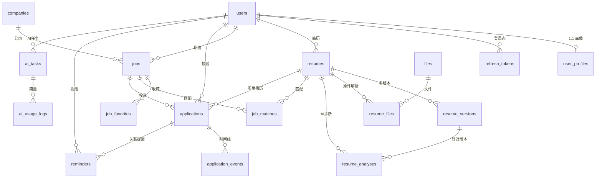

# 03 数据库设计

SQLite（生产目标 PostgreSQL，均为 Drizzle schema：`src/db/schema.ts`）。ID 为 UUID 文本主键；时间戳 `timestamp_ms` 整数；JSON 列为带类型的 json text；覆盖简历/职位/投递的软删除（deleted_at）。

## ER 总览（6 域 20 表）

## 各域表结构

### 用户域
| 表 | 关键字段 | 说明 |
|---|---|---|
| `users` | email(uq), password_hash(bcrypt), name, status | status: active/disabled |
| `user_profiles` | user_id(PK/FK CASCADE), expected_position/city, salary_min/max, experience_years, education, skills(json) | 求职画像，匹配时使用 |
| `refresh_tokens` | user_id, token_hash(uq, sha256), expires_at, revoked_at | 轮换式刷新令牌，仅存哈希 |

### 简历域
| 表 | 关键字段 | 说明 |
|---|---|---|
| `resumes` | user_id(idx), title, is_primary, deleted_at | 主简历唯一由服务层保证 |
| `resume_versions` | resume_id(idx), version_no, content(json ResumeContent), source(manual/upload/ai), note | content 结构：basics/summary/skills/experience/education/projects |
| `resume_files` | resume_id, file_id, parse_status(pending/done/failed), parse_error | 上传解析状态 |
| `resume_analyses` | resume_id(idx), version_id, task_id, score(0-100), issues(json), suggestions(json) | AI 诊断报告，建议需用户确认 |

### 职位域
| 表 | 关键字段 | 说明 |
|---|---|---|
| `companies` | name(uq), industry, size, description | 按名称自动建档 |
| `jobs` | user_id(idx), company_id(FK SET NULL), company_name, title, city, salary_min/max, description(原始JD), structured(json JobStructured), source, source_url, status(active/archived), deleted_at | structured: title/city/salary/experienceYearsMin/education/skills[{name,weight}]/responsibilities/requirements |
| `job_favorites` | (user_id, job_id) uq | 收藏 |

### 匹配域
| 表 | 关键字段 | 说明 |
|---|---|---|
| `job_matches` | (user_id, job_id, resume_id) uq, total_score(real), dimension_scores(json), gaps(json), reasons(json), summary, task_id | 幂等 upsert；重算后 summary 置空等待 AI 重解读 |
| `embeddings` | (owner_type, owner_id)(idx), chunk, dim, vector(json), model | 预留向量检索（MVP 用 Mock embed） |

### 投递域
| 表 | 关键字段 | 说明 |
|---|---|---|
| `applications` | (user_id, job_id) uq, resume_id(FK SET NULL), stage, applied_at, next_action_at, notes | stage: wishlist/applied/written_test/interview/offer/rejected/closed |
| `application_events` | application_id(idx), type(created/stage_change/note), from_stage, to_stage, note, occurred_at | 不可变时间线，漏斗按此去重统计 |
| `reminders` | user_id(idx), application_id(FK CASCADE), title, content, remind_at(idx), status(pending/done/ignored), done_at | 站内提醒 |

### AI 与通用域
| 表 | 关键字段 | 说明 |
|---|---|---|
| `ai_tasks` | user_id(idx), type, status(queued/running/succeeded/failed), input(json), output(json), error, provider, model, prompt/completion_tokens, duration_ms | 异步任务状态机，全链路可追溯 |
| `ai_usage_logs` | user_id(idx), task_id, scene, provider, model, prompt/completion_tokens, cost | 限额与成本核算依据 |
| `files` | user_id, name, mime, size, path | 上传原件 |
| `notifications` | user_id(idx), type, title, content, is_read | 站内通知（预留） |

## 关键设计决策

1. **AI 输出全部落库**：ai_tasks.input/output + 业务表（structured/content/analysis/summary）双写，可审计、可回放、避免重复计费调用。
2. **唯一约束承载业务幂等**：job_matches / applications / job_favorites 的复合唯一索引 + `onConflict` upsert，重复操作天然幂等。
3. **状态机约束在服务层**：STAGE_TRANSITIONS 白名单（shared/types.ts），非法流转抛 6002；数据库不设 CHECK，便于调参。
4. **级联删除**：user → 全部子资源 CASCADE（满足注销即删）；job → application CASCADE；resume 被 application 引用时 SET NULL 保留投递历史。
5. **迁移策略**：`drizzle-kit generate` 产出 SQL 至 `./drizzle`，`getDb()` 启动时 `migrate()` 幂等应用；测试库与开发库同构（DB_PATH 切换）。
