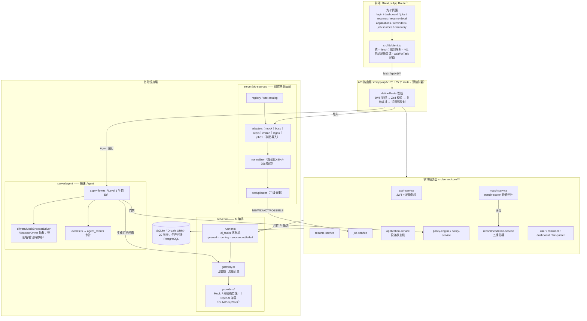
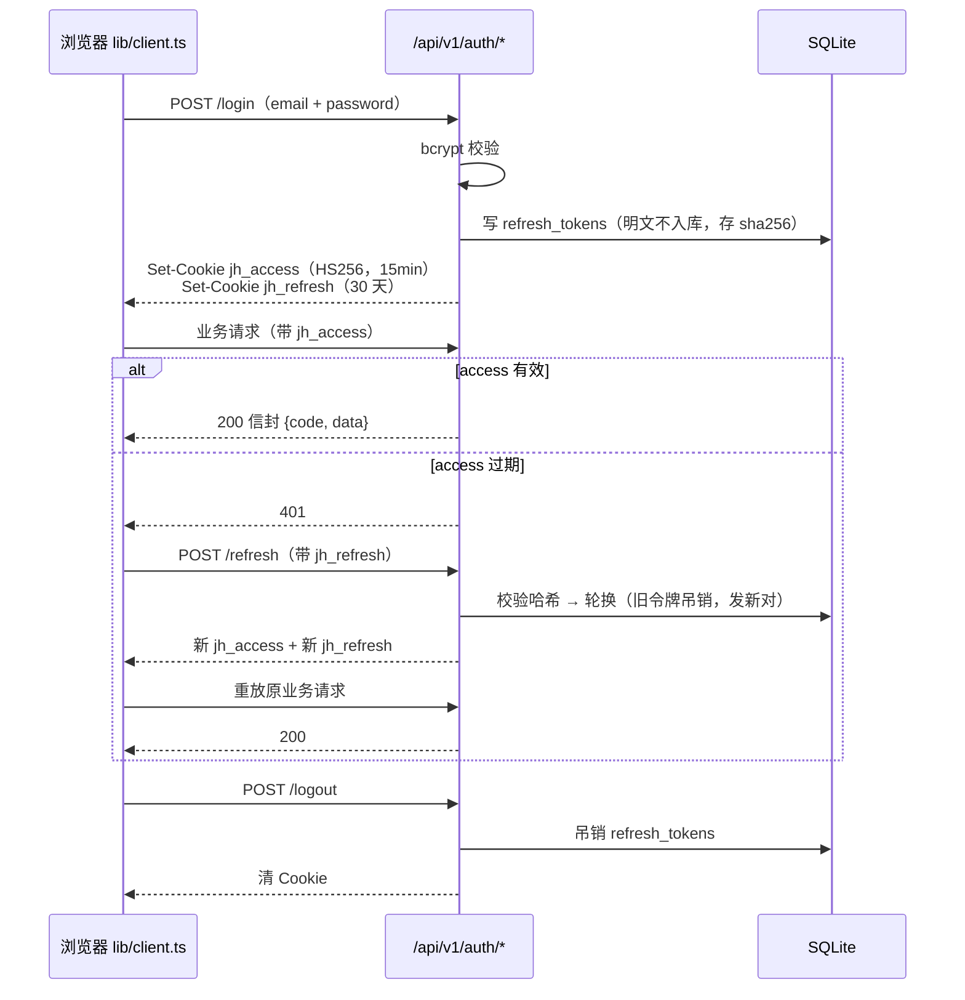
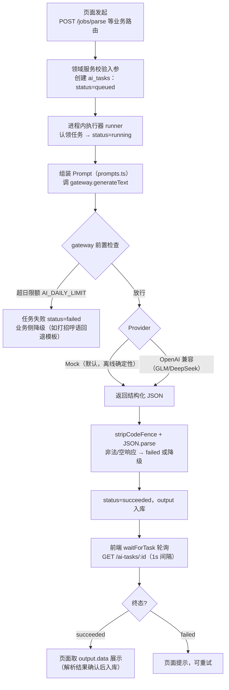
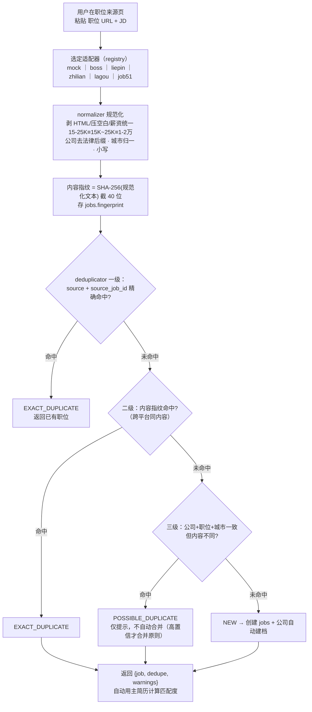
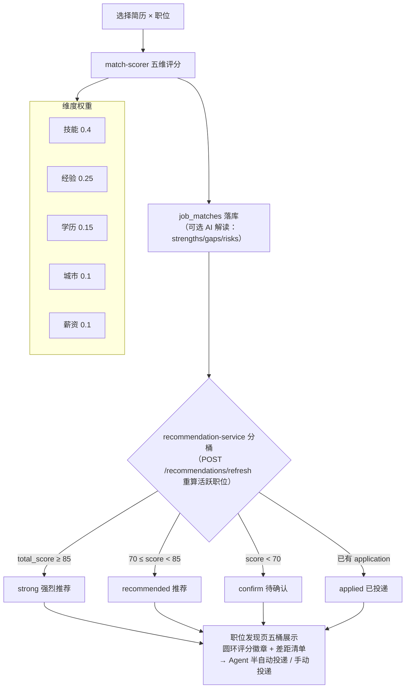
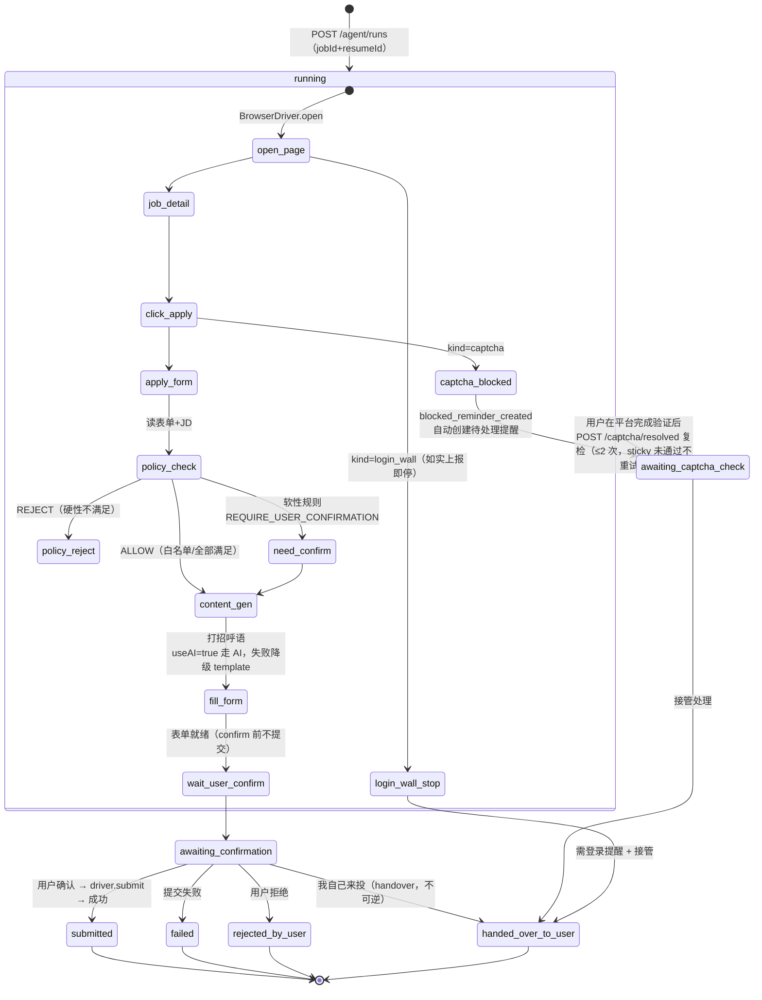

# 14 架构与流程图

> 本文用 Mermaid 描述 JobHunter 的系统架构、项目结构与核心流程。所有状态名、表名、阈值均取自当前代码（`src/server/**`、`src/db/schema.ts`），与 [02 技术架构](02-技术架构.md)、[03 数据库设计](03-数据库设计.md)、[04 API 设计](04-API设计.md)、[08 JobSource 架构](08-job-source-architecture.md)、[11 Agent 安全](11-agent-security.md)、[13 V3 Phase 2 测试报告](13-v3-phase2-test-report.md) 保持一致。
>
> 本地可视化：双击 `design/architecture.html`（浏览器渲染同源图的交互版）。

## 目录

- [1. 系统分层架构](#1-系统分层架构)
- [2. 项目目录结构](#2-项目目录结构)
- [3. 数据模型 ER 图](#3-数据模型-er-图)
- [4. 认证流程](#4-认证流程)
- [5. AI 异步任务流程](#5-ai-异步任务流程)
- [6. 职位导入与去重流程](#6-职位导入与去重流程)
- [7. 匹配与推荐流程](#7-匹配与推荐流程)
- [8. Agent 投递状态机](#8-agent-投递状态机)

---

## 1. 系统分层架构

四层结构：页面层 → 薄控制器层 → 领域服务层 → 基础设施层。请求自上而下、逐层收窄职责；AI 编排、职位来源适配、投递 Agent 是与领域服务平行的三个能力域。



要点：

- **薄控制器**：路由只做鉴权/校验/编排，业务规则全部下沉领域服务（见 docs/02 §2）。
- **AI 能力统一走网关**：Mock Provider 保证离线确定性测试，OpenAI 兼容 Provider 配置即切 GLM/DeepSeek。
- **Agent 永不绕过安全边界**：BrowserDriver 抽象约定登录墙/验证码如实上报即停（`src/server/agent/types.ts` 顶部注释即安全边界声明）。

## 2. 项目目录结构

```text
src/
├── app/                          # Next.js App Router
│   ├── (app)/                    # 登录后应用壳（侧边栏布局）
│   │   ├── layout.tsx            #   应用壳：鉴权重定向 + AppSidebar + 环境光斑
│   │   ├── dashboard/            #   数据看板（漏斗/趋势/环图）
│   │   ├── resumes/              #   简历工作台 + [id] 编辑器（AI 诊断/A4 预览/打印导出）
│   │   ├── jobs/                 #   职位中心（JD 粘贴 AI 解析、匹配）
│   │   ├── job-sources/          #   职位来源（引导式辅助导入）
│   │   ├── applications/         #   投递看板（Kanban + 详情弹窗）
│   │   ├── reminders/            #   提醒中心
│   │   └── discovery/            #   职位发现（五桶推荐 + Agent 运行面板）
│   ├── login/                    # 登录/注册（双主题品牌页）
│   ├── api/v1/                   # 35 个 REST 路由（薄控制器，详见 docs/04）
│   ├── globals.css               # 双主题设计 token（@theme inline + .dark）
│   └── layout.tsx                # 根布局（ToastProvider + 主题防闪烁脚本）
├── components/
│   ├── ui/                       # 基础组件库（button/badge/card/field/toast/…13 个）
│   ├── charts.tsx                # 手写 SVG 图表（漏斗/趋势面积图/环图/评分环）
│   ├── app-sidebar.tsx           # 侧边栏（分组导航 + active 药丸 + 主题切换）
│   ├── modal.tsx                 # 通用弹窗（ESC 关闭/尺寸变体）
│   └── resume/                   # A4 简历渲染（templates.ts 模板 spec + ResumePreview）
├── server/
│   ├── core/                     # 领域服务（auth/resume/job/match/application/policy/…）
│   ├── ai/                       # AI 网关（gateway/providers）+ 异步任务执行器（runner）
│   ├── job-sources/              # 来源适配（registry/site-catalog/normalizer/deduplicator + 6 适配器）
│   └── agent/                    # 投递 Agent（apply-flow/驱动抽象/events 审计）
├── db/                           # Drizzle：schema.ts（20 表）/ client.ts / seed.ts
├── lib/                          # client.ts（前端统一 fetch）/ session.ts（服务端会话）
├── shared/                       # 前后端共享类型与 Zod schema（唯一契约源）
└── testing/                      # 测试工具（内存 SQLite 等）
```

## 3. 数据模型 ER 图

20 张表（`src/db/schema.ts`）。核心主线：`users → resumes（多版本）→ job_matches → applications（流转事件）`；`jobs` 由 companies 归档；`ai_tasks / agent_events` 是 AI 与 Agent 的审计底座。

```mermaid
erDiagram
    users ||--o| user_profiles : "求职画像"
    users ||--o{ refresh_tokens : "刷新令牌（sha256 哈希轮换）"
    users ||--o{ resumes : "拥有"
    users ||--o{ application_policies : "投递策略"
    users ||--o{ reminders : "提醒"

    resumes ||--o{ resume_versions : "多版本"
    resumes ||--o{ resume_files : "上传解析原件"
    resumes ||--o{ resume_analyses : "AI 诊断"
    resumes ||--o{ job_matches : "参与匹配"
    files ||--o{ resume_files : "文件存储"

    companies ||--o{ jobs : "建档"
    jobs ||--o{ job_favorites : "收藏"
    jobs ||--o{ job_matches : "被匹配"
    jobs ||--o{ applications : "被投递"
    jobs ||--o{ embeddings : "向量化（预留）"

    applications ||--o{ application_events : "状态流转/备注时间线"
    applications ||--o{ reminders : "关联提醒"
    applications ||--o{ agent_events : "Agent 投递留痕"
    users ||--o{ applications : "发起"
    users ||--o{ job_matches : "评分主体"
    users ||--o{ ai_tasks : "任务归属"

    users {
        string id PK
        string email UK
        string password_hash
    }
    user_profiles {
        string user_id FK
        string desired_title
        string city
        int salary_min
    }
    resumes {
        string id PK
        string user_id FK
        string title
        bool is_primary
        json style
    }
    resume_versions {
        string id PK
        string resume_id FK
        int version_no
        string source "manual|ai|upload"
        json content
    }
    resume_analyses {
        string id PK
        string resume_id FK
        int score
        json suggestions
    }
    companies {
        string id PK
        string name
    }
    jobs {
        string id PK
        string company_id FK
        string title
        string fingerprint UK "规范化内容 SHA-256 截 40 位"
        string source
        string source_job_id
        json structured
    }
    job_matches {
        string id PK
        string job_id FK
        string resume_id FK
        number total_score
        json explanation "strengths/gaps/risks"
    }
    applications {
        string id PK
        string user_id FK
        string job_id FK
        string stage "wishlist→applied→written_test→interview→offer/rejected/closed"
    }
    application_events {
        string id PK
        string application_id FK
        string type "create|stage_change|note"
    }
    application_policies {
        string user_id PK
        json rules "白名单/硬性/软性"
    }
    reminders {
        string id PK
        string user_id FK
        string application_id FK
        string status "pending|done|ignored"
    }
    ai_tasks {
        string id PK
        string user_id FK
        string type "parse_jd|parse_resume|optimize_resume|tailor_resume"
        string status "queued|running|succeeded|failed"
        json output
    }
    agent_events {
        string id PK
        string session_id
        string user_id FK
        string action
        string result "success|blocked|failed|waiting_user"
    }
    refresh_tokens {
        string id PK
        string user_id FK
        string token_hash
        datetime expires_at
    }
```



> `files / resume_files / embeddings / notifications` 为存储与预留扩展位。字段仅列主干，完整定义见 docs/03 与 schema.ts。

## 4. 认证流程

JWT access（15 分钟）+ 随机刷新令牌（30 天，仅存 SHA-256 哈希，一次性轮换 + 可吊销），httpOnly Cookie 下发；前端 `lib/client.ts` 收到 401 自动刷新并重放原请求。



## 5. AI 异步任务流程

四类任务（JD 解析 / 简历解析 / 诊断优化 / JD 定制）统一走 `ai_tasks` 表 + 进程内执行器（接口与 BullMQ 对齐，生产可换 Worker）；前端 `waitForTask` 轮询至终态。



## 6. 职位导入与去重流程

来源无公开 API 时由用户复制 URL+JD，适配器做 `assistedImport`（仅辅助，不碰用户平台凭证）；normalizer 规范化后计算内容指纹，deduplicator 三级判定。



## 7. 匹配与推荐流程

评分器五维加权（`match-scorer.ts`：技能 0.4 / 经验 0.25 / 学历 0.15 / 城市 0.1 / 薪资 0.1），结果落 `job_matches`；推荐接口按分数实时分桶，不改动评分器语义。



## 8. Agent 投递状态机

Level 1 半自动投递（`apply-flow.ts` + MockBrowserDriver）：全程经策略门禁，提交前必须用户确认；登录墙/验证码如实上报即停、绝不绕过；接管不可逆。



安全红线（docs/11、13）：不绕过验证码/登录/MFA/风控；不隐藏自动化；默认 Human-in-the-loop；验证码复检上限 2 次（`MAX_CAPTCHA_RESUMES`），未真正通过保持 blocked（sticky）。
